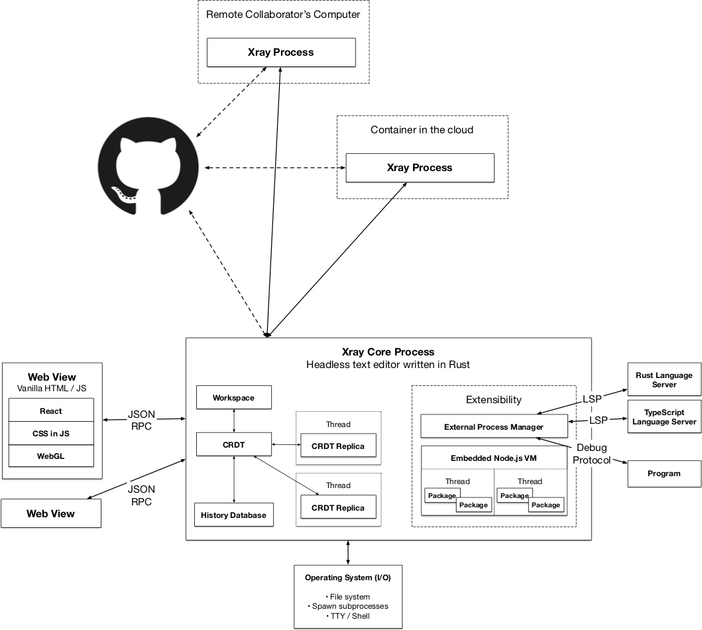

# Update for April 9, 2018

## New Contributor interest

Thanks to everyone who jumped in with an interest in contributing! The engagement was really helpful and prompted me to post [the beginnings of a contributing guide](https://github.com/siberianmh/isobar/blob/master/CONTRIBUTING.md) and some initial [help-wanted issues](https://github.com/siberianmh/isobar/labels/help%20wanted). Looking forward to engaing with someone who wants to dive in on one of those problems.

## Progress on selections

We have selections and cursors rendering on a branch, and hope to merge it this week. The results are pormising, and we're only exceeding out 8 ms frame budget when we reach thousands of selections in a document with thousands of edits. We think we can do better with some optimizations.

We plan to merge an initial PR that lays the groundwork this week. This will include the ability to model and render selections, but we need to get a basic key bindings and commands system in place before this will mean much in the UI. We'll post some more detailed benchmarks once we get this implementation integrated and have a chance to look at the profile for any basic optimizations.

## Big architectural changes incoming

Originally, we planned to embed a shared library written in Rust into the Electron render process and use Node's N-API to interoperate. Somewhere along the line, we realized that to maintain a global edit history for all files that wasn't tied to a project, we would need to unify all of the file system interaction in a single process to avoid race conditions between multiple Electron windows. This process gradually grew in our thinking to take on other responsibilities, such as connecting to other processes to faciliate real time collaboration. Evetually, we decided that we would need to route all I/O through this central process.

If we're planning to route all I/O through an external process, then what's the point of the Node APIs available in Electron? They're all designed around I/O, but we won't be doing any. This made it click for me that we should actually move *all* of the application logic completely into the external Rust porcess and treat the UI as an extremely thin layer that interacts with the app via an async channel. We'll use something akin to the Flux architecture, where the UI can submit actions to the server on the channel and receive JSON payloads representing state to render. Yes, I realize that this makes us even *more* similar to Xi architecturally.

This will make the UI code 100% ordinary HTML and JavaScript with no assumption of any special APIs, which really supports our goal of running supports our goal of running on the web. For the desktop experience, we can use any solution that gives us a modern, standards-compliant web view and run the code of th eapplication as a server process. The easiest solution on the desktop would be Electron, but we could even use an embedded WebKit view on the Mac to save on budle size if we wanted to absorb that complexity (it's not clear it's worth it though). On the web, we'll need the server process to run iside the browser, because this whole design assumes an ultra-low-latency connection between the front end and the back end. In this scenario, we can compile some subset of the server process that runs on the desktop to WebAssembly and run it in a worker thread. This web "back end" can then establish a peer-to-peer connection with another Isobar process running in the cloud or on another user's computer. This will provide a 100% compatible experience between the browser and the desktop and enable collaboration between users in either environment.

Here's a somewhat complicated picture of our current thinking. Note the centrality of the "Isobar Core Process". All the logic and extensibility lives there, and the view becomes much simpler.

We'll be starting on these changes this week. The first step is to completely eliminate Electron and wrap `isobar_core` in a server process, which we're thinking about calling `isobar_server`. The front end will be `isobar_client` and compile down to a simple HTML file. When you open it in the browser, it will connect to a local port based on the query parameter in the URL.

Once we accomplish that, we'll need to figure out an alternate variant of the server, maybe called `isobar_server_wasm`, which runs a "server" in one or more worker threads for low-latency experience on the web. Compiling pure Rust to WebAssembly hopefully won't be a big deal, but we are a bit worried about including TreeSitter, whose runtime and grammars are written in C. We think we can figure it out though.

In light of these big structural changes, we'll probably be holding off on merging any PRs this week until the dust has settled. Thanks for your patience.
